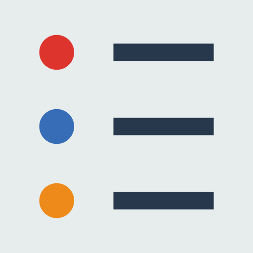

<!-- PROJECT LOGO -->
   
    

  
  <h1 align="center">TuDu</h1>
  

    A simple To-Do Web App written in React
  

  
  <!-- TABLE OF CONTENTS -->
  ## Table of Contents
  
  - [Table of Contents](#table-of-contents)
  - [About The Project](#about-the-project)
  - [SIP Requests](#sip-requests)
    - [INVITE](#INVITE)
    - [ACK](#ACK)
    - [BYE](#BYE)
  - [UML Diagrams](#uml-diagrams)
    - [Class Diagram](#class-diagram)
  - [Getting Started](#getting-started)
    - [Libraries](#Libraries)
    - [Updates](#updates)
  - [License](#license)
  - [Contributors](#contributors)
   
   <!-- ABOUT THE PROJECT -->
   ## About The Project
   **TooDoo**
   TooDoo is a simple To-Do List Web App written in React, a JavaScript framework created by the smart folks at Facebook

## LICENSE

Distributed under the GPL License. See `LICENSE` for more information.

   
Icons made by <a href="https://www.flaticon.com/authors/freepik" title="Freepik">Freepik</a> from <a href="https://www.flaticon.com/" 
   title="Flaticon"> www.flaticon.com</a>

   
   <!-- CONTRIBUTORS -->
   ## CONTRIBUTORS

[Mattia Ricci](https://github.com/tiaringhio)
